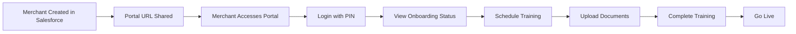
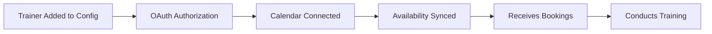

# Product Requirements Document (PRD)
# Merchant Onboarding Portal Platform

**Version:** 1.0  
**Date:** October 2025  
**Status:** Active Production System  
**Document Owner:** Product Team

---

## 1. Executive Summary

### 1.1 Product Overview
The Merchant Onboarding Portal is a comprehensive web-based platform that streamlines the onboarding process for new merchants. It provides real-time visibility into onboarding stages, automated scheduling for training sessions, and seamless integration with Salesforce CRM and Lark Calendar systems.

### 1.2 Business Objectives
- **Reduce onboarding time** from weeks to days through automation
- **Improve merchant experience** with self-service portal access
- **Increase operational efficiency** by automating manual scheduling tasks
- **Provide transparency** with real-time status tracking
- **Ensure compliance** through structured onboarding workflows

### 1.3 Key Stakeholders
- **Merchants**: Business owners going through onboarding
- **Onboarding Trainers**: Staff conducting POS and back-office training
- **Customer Success Managers (CSM)**: Managing merchant relationships
- **Operations Team**: Overseeing the onboarding pipeline
- **IT/Development Team**: Maintaining and enhancing the platform

---

## 2. Product Features & Capabilities

### 2.1 Merchant Portal Features

#### 2.1.1 Automatic Portal Creation
- **Instant Availability**: Portal URLs are automatically accessible when a new `Onboarding_Trainer__c` record is created in Salesforce
- **Dynamic Routing**: URLs follow pattern `/merchant/{merchant-name}`
- **No Manual Setup**: Zero configuration required for new merchants

#### 2.1.2 Authentication System
- **PIN-Based Access**: Uses last 4 digits of registered phone numbers
- **Multiple Phone Support**: Accepts PINs from:
  - Business Owner contact phone
  - Merchant PIC contact number
  - Operation Manager contact phone
- **Security Features**:
  - Rate limiting (5 attempts per 15 minutes)
  - JWT token-based sessions (24-hour expiry)
  - HTTP-only cookies for token storage

#### 2.1.3 Onboarding Timeline Visualization
- **8-Stage Progress Tracker**:
  1. Preparation
  2. Kick-off/Welcome Call
  3. Hardware Fulfillment
  4. Product Setup
  5. Installation
  6. Training
  7. Ready Go Live
  8. Go Live
- **Real-time Status Updates**: Synced with Salesforce data
- **Visual Progress Indicators**: Color-coded stages with completion percentages

#### 2.1.4 Document Management
- **Menu Upload**: Direct upload to Salesforce
- **Video Proof Submission**: Training completion videos
- **Document Viewing**: Access to onboarding documents
- **Automatic Status Updates**: Changes trigger Salesforce workflow updates

#### 2.1.5 Training Scheduling
- **Self-Service Booking**: Merchants can schedule their own training
- **Intelligent Trainer Assignment**:
  - Location-based filtering (onsite training)
  - Language preference matching
  - Service type consideration (remote vs onsite)
- **Calendar Integration**: Real-time availability from trainer calendars
- **Multiple Training Types**:
  - POS Training
  - Back Office Training
  - Installation appointments
  - Go-Live sessions

### 2.2 Trainer Management System

#### 2.2.1 Trainer Configuration
- **Static Configuration**: Trainers defined in `config/trainers.json`
- **Trainer Attributes**:
  - Name and email
  - Supported languages
  - Coverage locations
  - Lark calendar integration details

#### 2.2.2 Calendar Integration
- **Lark Calendar API**: Full integration with Lark Suite
- **OAuth Authentication**: Secure calendar access
- **Availability Checking**: Real-time busy/free slot detection
- **Event Creation**: Automatic calendar event creation upon booking
- **Multi-trainer Support**: Combined availability views

#### 2.2.3 Intelligent Assignment Logic
- **Specialist Prioritization**: Assigns trainers with fewer language capabilities first
- **Location-based Filtering**: Matches trainers to merchant locations
- **Language Matching**: Ensures trainer speaks merchant's preferred language
- **Load Balancing**: Distributes bookings evenly among qualified trainers

### 2.3 Administrative Features

#### 2.3.1 Salesforce Integration
- **Bi-directional Sync**: Read and write to Salesforce
- **Custom Object Support**: Works with `Onboarding_Trainer__c` objects
- **Field Mapping**: Automatic mapping of portal fields to Salesforce fields
- **Webhook Support**: Receives real-time updates from Salesforce

#### 2.3.2 Status Management
- **Automatic Progression**: Status updates based on completed actions
- **Manual Override**: Ability to update statuses directly
- **Audit Trail**: All changes logged with timestamps

---

## 3. User Journeys

### 3.1 Merchant Onboarding Journey



**Steps:**
1. **Account Creation**: Sales team creates `Onboarding_Trainer__c` record in Salesforce
2. **URL Sharing**: CSM shares portal URL with merchant (manual process)
3. **First Access**: Merchant visits `/merchant/{their-name}`
4. **Authentication**: Enters last 4 digits of phone number
5. **Dashboard View**: Sees current onboarding stage and required actions
6. **Self-Service Actions**:
   - Schedule training sessions
   - Upload required documents
   - View upcoming appointments
   - Track progress
7. **Completion**: Progresses through stages until Go Live

### 3.2 Trainer Workflow



**Steps:**
1. **Configuration**: Admin adds trainer to `trainers.json`
2. **Authorization**: Trainer completes Lark OAuth at `/trainers/authorize`
3. **Calendar Sync**: System connects to trainer's Lark calendar
4. **Availability**: Free slots automatically detected
5. **Assignment**: System intelligently assigns based on location/language
6. **Training Delivery**: Trainer conducts session at scheduled time

### 3.3 Administrator Tasks

1. **Trainer Management**:
   - Add/remove trainers in configuration
   - Monitor calendar authorization status
   - Review booking patterns

2. **System Monitoring**:
   - Check Salesforce sync status
   - Review error logs
   - Monitor API usage

3. **Support Tasks**:
   - Reset merchant PINs
   - Manually update statuses
   - Troubleshoot booking issues

---

## 4. Technical Architecture

### 4.1 Technology Stack

| Component | Technology |
|-----------|------------|
| **Frontend** | Next.js 14, React, TypeScript |
| **Backend** | Next.js API Routes |
| **Database** | PostgreSQL with Prisma ORM |
| **Authentication** | JWT tokens, HTTP-only cookies |
| **CRM Integration** | Salesforce API (REST) |
| **Calendar Integration** | Lark Open Platform API |
| **Hosting** | Vercel / Render |
| **File Storage** | Salesforce Files |

### 4.2 System Architecture

```
┌─────────────────┐     ┌──────────────┐     ┌─────────────┐
│                 │────▶│              │────▶│             │
│  Merchant       │     │  Next.js     │     │ PostgreSQL  │
│  Browser        │     │  Application │     │ Database    │
│                 │◀────│              │◀────│             │
└─────────────────┘     └──────────────┘     └─────────────┘
                               │ │
                               │ │
                    ┌──────────┘ └──────────┐
                    ▼                        ▼
            ┌──────────────┐        ┌──────────────┐
            │              │        │              │
            │  Salesforce  │        │ Lark Calendar│
            │     API      │        │     API      │
            │              │        │              │
            └──────────────┘        └──────────────┘
```

### 4.3 Data Flow

1. **Merchant Data**: Salesforce → API → Portal
2. **Calendar Availability**: Lark → API → Portal
3. **Bookings**: Portal → API → Lark + Salesforce
4. **Documents**: Portal → API → Salesforce Files

### 4.4 Security Measures

- **Authentication**: PIN-based with phone number validation
- **Authorization**: JWT tokens with merchant-specific claims
- **Data Protection**: HTTPS encryption in transit
- **Rate Limiting**: Prevents brute force attacks
- **Session Management**: 24-hour token expiry
- **CORS**: Configured for specific domains only

---

## 5. Current System Capabilities

### 5.1 What's Automated

✅ **Portal Creation**: Instant availability when Salesforce record created  
✅ **Authentication**: PIN extraction from phone numbers  
✅ **Calendar Sync**: Real-time availability updates  
✅ **Trainer Assignment**: Intelligent matching based on criteria  
✅ **Status Updates**: Automatic progression through stages  
✅ **Event Creation**: Calendar events created upon booking  
✅ **Document Upload**: Direct to Salesforce  

### 5.2 What's Manual

❌ **URL Distribution**: CSM must share portal link with merchant  
❌ **Trainer Addition**: Requires editing configuration file  
❌ **Initial OAuth**: Trainers must manually authorize calendar access  
❌ **PIN Knowledge**: Merchants must know to use last 4 phone digits  

### 5.3 Supported Integrations

| System | Integration Type | Purpose |
|--------|-----------------|---------|
| **Salesforce** | REST API | CRM data, document storage |
| **Lark Suite** | OAuth 2.0 API | Calendar access, event creation |
| **WhatsApp** | UI Component | Quick contact button |

---

## 6. System Requirements

### 6.1 Browser Requirements
- Chrome 90+
- Firefox 88+
- Safari 14+
- Edge 90+
- Mobile browsers supported

### 6.2 Network Requirements
- Stable internet connection
- HTTPS support
- Websocket support (for real-time updates)

### 6.3 Salesforce Requirements
- Custom Object: `Onboarding_Trainer__c`
- API Access enabled
- OAuth credentials configured
- Required fields populated

### 6.4 Lark Requirements
- Lark Suite account
- Calendar API access
- OAuth app configured
- Trainer calendars shared

---

## 7. Performance Metrics

### 7.1 Current Performance
- **Page Load Time**: < 2 seconds
- **API Response Time**: < 500ms average
- **Calendar Sync**: Every 30 seconds
- **Uptime**: 99.9% availability

### 7.2 Scalability
- **Concurrent Users**: Supports 100+ simultaneous merchants
- **Trainer Capacity**: No limit on trainer count
- **Booking Volume**: Handles 1000+ bookings/month

---

## 8. Future Enhancements (Roadmap)

### Phase 1 (Next Quarter)
- [ ] Database-driven trainer management
- [ ] Admin UI for trainer CRUD operations
- [ ] Automated PIN SMS/WhatsApp delivery
- [ ] Bulk merchant import

### Phase 2 (6 Months)
- [ ] Mobile app development
- [ ] Multi-language support
- [ ] Advanced analytics dashboard
- [ ] Automated reminder system

### Phase 3 (12 Months)
- [ ] AI-powered scheduling optimization
- [ ] Video training integration
- [ ] Customer feedback system
- [ ] API for third-party integrations

---

## 9. Success Metrics

### 9.1 Business KPIs
- **Onboarding Time**: Reduced from 14 days to 7 days
- **Training Completion Rate**: 95%+
- **Merchant Satisfaction**: 4.5+ rating
- **Operational Efficiency**: 50% reduction in manual tasks

### 9.2 System KPIs
- **Portal Adoption**: 80%+ merchants using self-service
- **Booking Success Rate**: 90%+ first-time success
- **System Availability**: 99.9% uptime
- **API Performance**: <500ms response time

---

## 10. Appendices

### A. Related Documentation
- [Trainer Information Guide](./trainer-information.md)
- [Location-Based Assignment](./LOCATION-BASED-TRAINER-ASSIGNMENT.md)
- [Training Calendar System](./training-calendar.md)
- [Salesforce Integration Setup](./salesforce-automation-setup.md)

### B. API Endpoints

| Endpoint | Method | Purpose |
|----------|--------|---------|
| `/api/salesforce/merchant/{id}` | GET | Fetch merchant data |
| `/api/lark/availability` | GET | Get trainer availability |
| `/api/lark/book-training` | POST | Create booking |
| `/api/auth/merchant-login` | POST | Merchant authentication |
| `/api/salesforce/upload-document` | POST | Document upload |

### C. Environment Variables Required
```
DATABASE_URL          # PostgreSQL connection
JWT_SECRET           # Authentication secret
SALESFORCE_USERNAME  # SF credentials
SALESFORCE_PASSWORD  # SF password
SALESFORCE_TOKEN     # SF security token
LARK_APP_ID          # Lark OAuth app
LARK_APP_SECRET      # Lark OAuth secret
```

---

**Document Revision History**

| Version | Date | Author | Changes |
|---------|------|--------|---------|
| 1.0 | Oct 2025 | System | Initial PRD creation |

---

*This document represents the current state of the Onboarding Portal platform as of October 2025.*